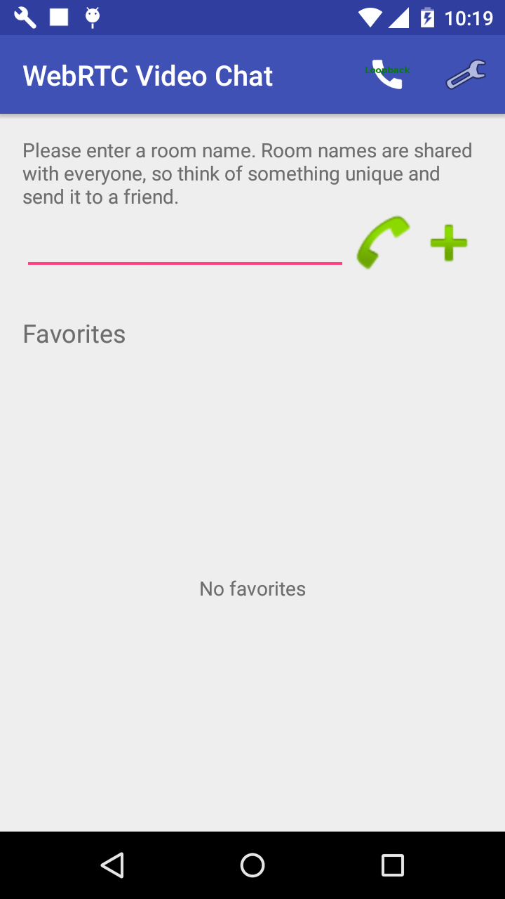
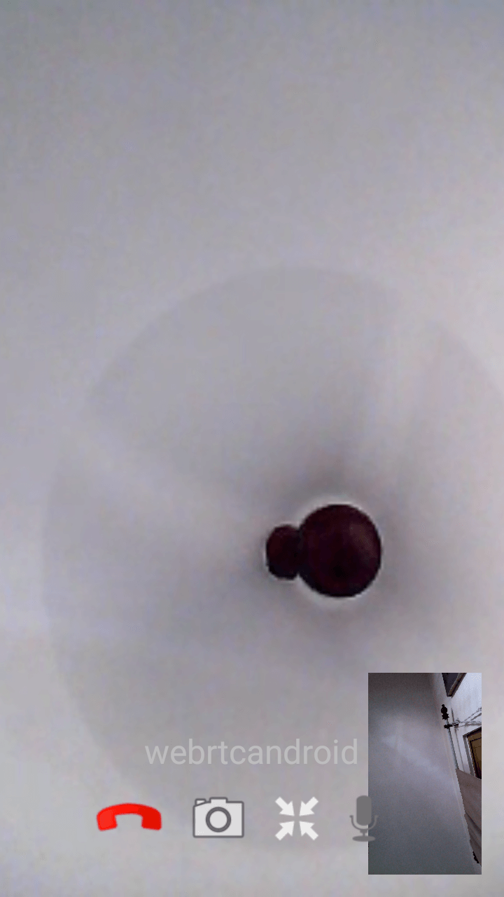
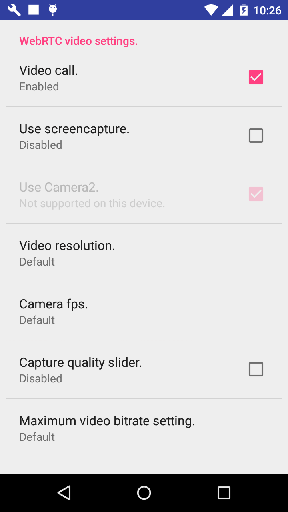

# WebRTCAndroid
This is an Android Studio reference project for WebRTC based video and voice calling app. (https://appr.tc)

For downloading the latest source follow the instructions given [here](https://webrtc.org/native-code/android/). 

## Modifications

1. The code has been split into library and app modules for easy reference. 
2. Changes incorporated for requesting runtime permissions and targetSdkVersion updated to 27 (Oreo).
3. Added dependency to official prebuilt library available at JCenter 'org.webrtc:google-webrtc'.

## Miscellaneous

The app connects to AppRTC server hosted by Google. If you wish to deploy your own server then follow the instructions given [here](https://github.com/webrtc/apprtc). Or you may use out-of-the-box docker image for AppRTC-Server available [here](https://hub.docker.com/r/piasy/apprtc-server/).

Once your server is up and running, you will need to specify the server url in the Settings screen of the app. Update 'Room server URL' under Miscellaneous settings.

